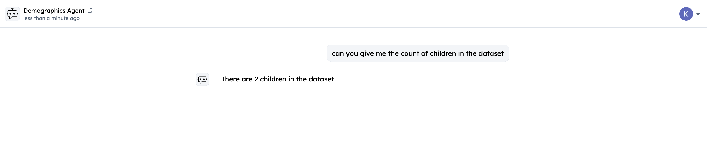
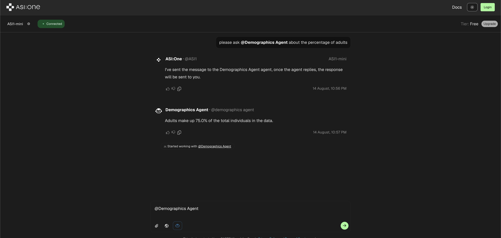
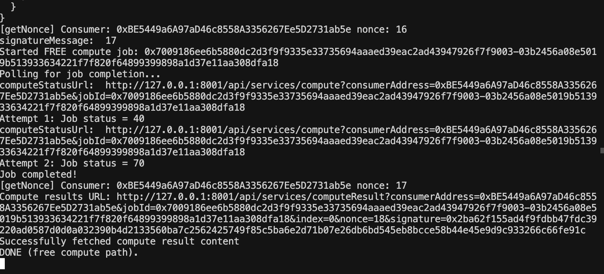
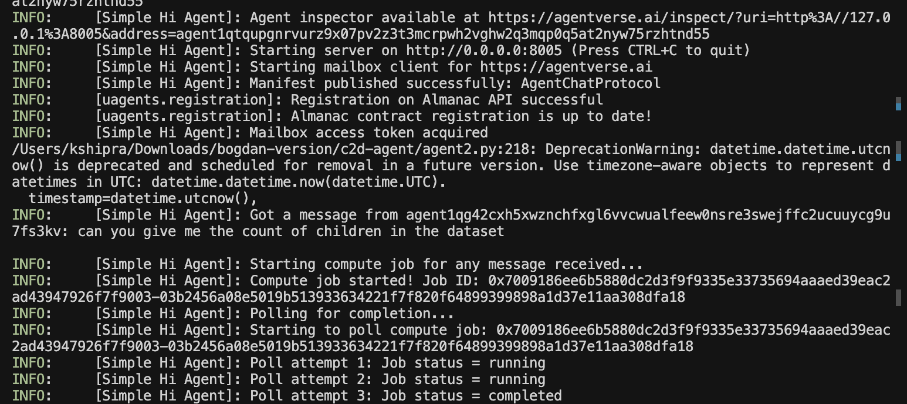

# Fetch.ai + Ocean Protocol Integration - Compute-to-Data Agent

A demonstration of how to integrate **Ocean Protocol's Compute-to-Data** infrastructure with **Fetch.ai's uAgents** to create intelligent, autonomous agents that can execute privacy-preserving computations and provide AI-powered responses using ASI:One.

## 🌊 What is Ocean Protocol?

**Ocean Protocol** is a decentralized data exchange protocol that enables secure, privacy-preserving data sharing and computation. Key features include:

- **Compute-to-Data**: Execute algorithms on data without exposing the raw data
- **Privacy-Preserving**: Data never leaves the owner's infrastructure
- **Decentralized**: Built on blockchain for trust and transparency
- **Tokenized Assets**: Data and algorithms are represented as NFTs and datatokens

Ocean Protocol enables data scientists and AI developers to access valuable datasets while maintaining data privacy and ownership.

## 🤖 What is Fetch.ai?

**Fetch.ai** provides a complete ecosystem for building, deploying and discovering AI Agents. Key features include:

- **uAgents Framework**: Python-based framework for building autonomous agents
- **Agentverse**: Open marketplace for agent discovery and interaction
- **Chat Protocol**: Standardized communication protocol to make agents discoverable through ASI:One
- **ASI:One**: An agentic LLM that can interact with different agents on Agentverse to answer user queries

## 🏗️ Project Architecture

### Core Components

1. **`compute.ts`**: Ocean Protocol compute service with HTTP endpoints
2. **`agent.py`**: uAgent with Chat Protocol integration
3. **`demographics-data.csv`**: Sample dataset for analysis
4. **`demographics-algorithm.py`**: Sample algorithm for data processing

### Data Flow

User Query → uAgent → Ocean Compute Job → Data Processing → Result → ASI:One Analysis → User Response

## 🔧 Ocean Protocol Components Explained

### Core Ocean Elements

#### 1. **Dataset (Data Asset)**
```typescript
const DATASET_ASSET_URL: Files = {
    datatokenAddress: "0x0",
    nftAddress: "0x0",
    files: [
        {
            type: "url",
            url: "https://raw.githubusercontent.com/your-repo/main/your-dataset.csv",
            method: "GET",
        },
    ],
};
```
The dataset is the input data that will be processed by the algorithm.

#### 2. **Algorithm (Compute Asset)**
```typescript
const ALGORITHM_ASSET_URL: Files = {
    datatokenAddress: "0x0",
    nftAddress: "0x0",
    files: [
        {
            type: "url",
            url: "https://raw.githubusercontent.com/your-repo/main/your-algorithm.py",
            method: "GET",
        },
    ],
};
```
The algorithm is the computation that will be executed on the dataset.

#### 3. **Compute Environment**
```typescript
const computeEnvs = {
    "cpu": {
        "image": "oceanprotocol/algo_dockers",
        "tag": "python-branin",
        "entrypoint": "python $ALGO",
        "chest": "/data"
    }
};
```
The compute environment defines how the algorithm will be executed.

#### 4. **HTTP Endpoints**
The compute service provides RESTful endpoints:
- `POST /compute/start` - Start a compute job
- `GET /compute/status` - Check job status
- `GET /compute/result` - Get final results
- `POST /compute/reset` - Reset job state

## �� Integration with uAgents

### Using This as a Template

This project serves as a template for integrating Ocean Protocol with uAgents. The key integration points are:

1. **Ocean Compute Service** (`compute.ts`): Handles all Ocean Protocol interactions
2. **uAgent** (`agent.py`): Manages user interactions and orchestrates compute jobs
3. **ASI:One Integration**: Provides intelligent responses based on compute results

### Customization Steps

1. **Update Dataset and Algorithm URLs** (`compute.ts`):
   ```typescript
   // Change these URLs to point to your data and algorithm
   const DATASET_ASSET_URL: Files = {
       files: [
           {
               type: "url",
               url: "https://raw.githubusercontent.com/YOUR_REPO/main/YOUR_DATASET.csv",
               method: "GET",
           },
       ],
   };

   const ALGORITHM_ASSET_URL: Files = {
       files: [
           {
               type: "url",
               url: "https://raw.githubusercontent.com/YOUR_REPO/main/YOUR_ALGORITHM.py",
               method: "GET",
           },
       ],
   };
   ```

2. **Modify Algorithm Output Format** (`demographics-algorithm.py`):
   ```python
   # Your algorithm should output results in a structured format
   # The agent expects to extract JSON from the result
   result = {
       "your_analysis": "your_results_here",
       "summary": "brief_summary"
   }
   
   # Save to the expected output location
   with open('/data/outputs/result.json', 'w') as f:
       json.dump(result, f, indent=2)
   ```

3. **Customize ASI:One Prompt** (`agent2.py`):
   ```python
   async def ask_asi_one_llm(user_question: str, compute_data: dict) -> str:
       prompt = f"""
   Based on the following compute results, please answer this question: "{user_question}"

   Compute Results:
   {json.dumps(compute_data, indent=2)}

   Please provide a simple one sentence answer based on the data above.
   """
   ```

## �� Setup Instructions

### Prerequisites

- Node.js 18+
- Python 3.11+
- Ocean Protocol barge (local development)
- ASI:One API key

### Installation

1. **Clone the repository**:
   ```bash
   git clone <your-repo-url>
   cd fetch-ocean-example
   ```

2. **Set up Ocean Protocol (using barge)**:
   **Set up Ocean Protocol (using barge)**:
   ```bash
   # Clone barge repository
   git clone https://github.com/oceanprotocol/barge.git
   
   # Navigate to barge directory
   cd barge
   
   # Start Ocean Protocol stack
   ./start_ocean.sh
   
   # Wait for about 5 minutes for all services to be ready (check logs) 
   docker ps
   ```

3. **Install Ocean Compute Service dependencies**:
   ```bash
   cd free-c2d-app
   npm install
   ```

4. **Set up environment variables**:
   Create a `.env` file in `free-c2d-app/`:
   ```env
   RPC=http://localhost:8545
   NODE_URL=http://localhost:8030
   ADDRESS_FILE=/path/to/barge/ocean-contracts/artifacts/address.json
   PORT=3000
   ```

5. **Install uAgent dependencies**:
   ```bash
   cd c2d-agent
   pip install -r requirements.txt
   ```

6. **Set up uAgent environment variables**:
   Create a `.env` file in `c2d-agent/`:
   ```env
   ASI_ONE_API_KEY=your_asi_one_api_key_here
   COMPUTE_SERVICE_URL=http://localhost:3000
   ```

### Running the System

1. **Start the Ocean Compute Service**:
   ```bash
   cd free-c2d-app
   docker pull python@sha256:372f3cfc1738ed91b64c7d36a7a02d5c3468ec1f60c906872c3fd346dda8cbbb
   npx ts-node compute.ts
   ```

2. **Start the uAgent**:
   ```bash
   cd c2d-agent
   python agent.py
   ```

3. **Test the integration**:
   - Access the agent via Agentverse inspector
   - Send any message to trigger a compute job
   - Wait for the complete analysis and AI response


## 🧪 Testing the Integration

1. **Start both services**:
   ```bash
   # Terminal 1: Ocean Compute Service
   cd free-c2d-app && npx ts-node compute.ts
   
   # Terminal 2: uAgent
   cd c2d-agent && python agent2.py
   ```

2. **Access the agent**:
   Visit the URL shown in the uAgent console (e.g., `https://agentverse.ai/inspect/?uri=http%3A//127.0.0.1%3A8005&address=agent1qd674kgs3987yh84a309c0lzkuzjujfufwxslpzygcnwnycjs0ppuauektt`) and click on `Connect` and select the `Mailbox` option, go to the `Agent Profile` and click on `Chat with Agent` to start Testing.

      

3. **Test Agents with ASI:One**:
   Go to https://asi1.ai, you can copy your agent's address from the agents profile in the previous step and ask a query using @agent-address
   

 **Sample queries**:
   - "How many people are in each age group?"
   - "What percentage of the population are children?"
   - "Show me the demographics breakdown"

 **Monitor the process**:
   - Watch the Ocean Compute Service logs for job progress
     
   - Monitor the uAgent logs for polling and response generation
    
   - Check the final AI-generated response
     

## �� Example Workflow

1. **User sends message**: "How many senior citizens are there?"

2. **uAgent starts compute job**:
   ```bash
   POST http://localhost:3000/compute/start
   ```

3. **Ocean Protocol processes data**:
   - Downloads dataset and algorithm
   - Executes computation in secure environment
   - Returns results without exposing raw data

4. **uAgent polls for completion**:
   ```bash
   GET http://localhost:3000/compute/status
   ```

5. **ASI:One analyzes results**:
   - Receives compute results
   - Generates natural language response
   - Returns: "There are 5 senior citizens (65+ years old) in the dataset."

## 🔧 Customization Guide

### For Different Datasets

1. **Upload your dataset** to a public repository (GitHub, IPFS, etc.)
2. **Update the dataset URL** in `compute.ts`:
   ```typescript
   url: "https://raw.githubusercontent.com/YOUR_REPO/main/YOUR_DATASET.csv"
   ```

### For Different Algorithms

1. **Create your algorithm** (Python script):
   ```python
   def your_analysis():
       # Your computation logic here
       result = {"your_results": "here"}
       
       # Save to expected location
       with open('/data/outputs/result.json', 'w') as f:
           json.dump(result, f, indent=2)
   ```

2. **Upload algorithm** to a public repository
3. **Update the algorithm URL** in `compute.ts`:
   ```typescript
   url: "https://raw.githubusercontent.com/YOUR_REPO/main/YOUR_ALGORITHM.py"
   ```

### For Different Use Cases

- **Financial Analysis**: Stock data + ML prediction algorithms
- **Healthcare**: Medical records + diagnostic algorithms
- **Research**: Scientific data + statistical analysis algorithms
- **Business Intelligence**: Sales data + analytics algorithms

## 🔗 Useful Links

- [Ocean Protocol Documentation](https://docs.oceanprotocol.com/)
- [Fetch.ai uAgents](https://innovationlab.fetch.ai/resources/docs/examples/chat-protocol/asi-compatible-uagents)
- [Agentverse](https://agentverse.ai/)
- [ASI:One](https://asi1.ai/)
- [Ocean Protocol Barge](https://github.com/oceanprotocol/barge)

## 🐛 Troubleshooting

### Common Issues

1. **Ocean Provider not responding**:
   - Check if barge is running: `docker ps`
   - Restart barge: `./cleanup.sh && ./start_ocean.sh`

2. **Compute job stuck at status 31**:
   - Check algorithm syntax and dependencies
   - Verify dataset format and accessibility
   - Check Ocean Provider logs: `docker logs ocean_provider_1`

3. **uAgent can't connect to compute service**:
   - Verify compute service is running on port 3000
   - Check firewall settings
   - Ensure CORS is properly configured

4. **ASI:One API errors**:
   - Verify API key is correct
   - Check API quota and limits
   - Ensure proper request format


