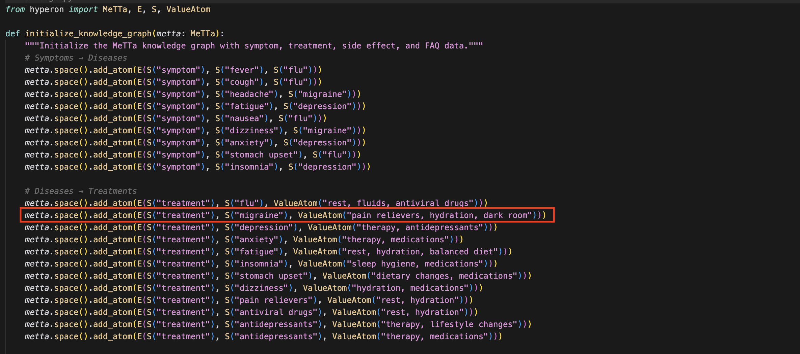

# Medical MeTTa Agent - Fetch.ai Hackathon Example

A demonstration of how to integrate **SingularityNET's MeTTa Knowledge Graph** with **Fetch.ai's uAgents** to create intelligent, autonomous agents that can understand and respond to medical queries using structured knowledge reasoning.


## 🤖 What is MeTTa by SingularityNET?

**MeTTa** (Meta Type Talk) is a multi-paradigm language for declarative and functional computations over knowledge (meta)graphs developed by SingularityNET. It provides a powerful framework for:

- **Structured Knowledge Representation**: Organize information in logical, queryable formats
- **Symbolic Reasoning**: Perform complex logical operations and pattern matching
- **Knowledge Graph Operations**: Build, query, and manipulate knowledge graphs

MeTTa uses a space-based architecture where knowledge is stored as atoms in logical spaces, enabling sophisticated querying and reasoning capabilities.

## 🔗 What is Fetch.ai?

**Fetch.ai** provides a complete ecosystem for building, deploying and discovering AI Agents. Key features include:

- **uAgents Framework**: Python-based framework for building autonomous agents
- **Agentverse**: Open marketplace for agent discovery and interaction
- **Chat Protocol**: Standardized communication protocol to make agents discoverable through ASI:One
- **ASI:One**: An agentic LLM that can interact with different agents on Agentverse to answer user queries.

## 🧠 MeTTa Components Explained

### Core MeTTa Elements

#### 1. **Space (Knowledge Container)**
```python
metta = MeTTa()  # Creates a new MeTTa instance with a space
```
The space is where all knowledge atoms are stored and queried.

#### 2. **Atoms (Knowledge Units)**
Atoms are the fundamental units of knowledge in MeTTa:

- **E (Expression)**: Creates logical expressions
- **S (Symbol)**: Represents symbolic atoms
- **ValueAtom**: Stores actual values (strings, numbers, etc.)

#### 3. **Knowledge Graph Structure**
```python
# Symptoms → Diseases
metta.space().add_atom(E(S("symptom"), S("fever"), S("flu")))

# Diseases → Treatments  
metta.space().add_atom(E(S("treatment"), S("flu"), ValueAtom("rest, fluids, antiviral drugs")))

# Treatments → Side Effects
metta.space().add_atom(E(S("side_effect"), S("antiviral drugs"), ValueAtom("nausea, dizziness")))
```

#### 4. **Querying with Pattern Matching**
```python
# Find diseases for a symptom
query_str = '!(match &self (symptom fever $disease) $disease)'
results = metta.run(query_str)
```

### Key MeTTa Concepts

- **`&self`**: References the current space
- **`$variable`**: Pattern matching variables
- **`!(match ...)`**: Query syntax for pattern matching
- **`E(S(...), S(...), ...)`**: Creates logical expressions

For more detailed information about MeTTa, visit the [official documentation](https://metta-lang.dev/docs/learn/tutorials/python_use/metta_python_basics.html).

## 🏗️ Project Architecture

### Core Components

1. **`agent.py`**: Main uAgent implementation with Chat Protocol to make the agent queyable through ASI:One.
2. **`knowledge.py`**: MeTTa knowledge graph initialization
3. **`medicalrag.py`**: Medical RAG (Retrieval-Augmented Generation) system
4. **`utils.py`**: LLM integration and query processing logic

### Data Flow

User Query → Intent Classification → MeTTa Query → Knowledge Retrieval → LLM Response → User


## �� Integration with uAgents

### Using This as a Template

This project serves as a template for integrating MeTTa with uAgents. The key integration point is the `process_query` function in `utils.py`, which you can customize for your specific use case.

### Customization Steps

1. **Modify Knowledge Graph** (`knowledge.py`):
   ```python
   def initialize_knowledge_graph(metta: MeTTa):
       # Add your domain-specific knowledge
       metta.space().add_atom(E(S("your_relation"), S("subject"), S("object")))
   ```

2. **Update Query Processing** (`utils.py`):
   ```python
   def process_query(query, rag: YourRAG, llm: LLM):
       # Implement your domain-specific logic
       intent, keyword = get_intent_and_keyword(query, llm)
       # Add your custom processing logic here
   ```

3. **Extend RAG System** (`medicalrag.py`):
   ```python
   class YourRAG:
       def __init__(self, metta_instance: MeTTa):
           self.metta = metta_instance
       
       def query_your_domain(self, query):
           # Implement your domain-specific queries
           query_str = f'!(match &self (your_relation {query} $result) $result)'
           return self.metta.run(query_str)
   ```

## �� Setup Instructions

### Prerequisites

- Python 3.11+
- ASI:One API key

### Installation

1. **Clone the repository**:
   ```bash
   git clone <your-repo-url>
   cd fetch-metta-example
   ```

2. **Create virtual environment**:
   ```bash
   python -m venv venv
   source venv/bin/activate  # On Windows: venv\Scripts\activate
   ```

3. **Install dependencies**:
   ```bash
   pip install -r requirements.txt
   ```

4. **Set up environment variables**:
    To get the ASI:One API Key, login to https://asi1.ai/ and go to **Developer** section, click on **Create New** and copy your API Key. Please refer this [guide](https://innovationlab.fetch.ai/resources/docs/asione/asi-one-quickstart#step-1-get-your-api-key) for detailed steps.

   ```bash
   cp .env.example .env
   # Edit .env with your API keys
   ```

5. **Run the agent**:
   ```bash
   python agent.py
   ```

### Environment Variables

Create a `.env` file with:
```env
ASI_ONE_API_KEY=your_asi_one_api_key_here
```

## �� Key Features

### 1. **Dynamic Knowledge Learning**
The agent can learn new information and add it to the MeTTa knowledge graph:
```python
# Automatically adds new knowledge when not found
rag.add_knowledge("symptom", "new_symptom", "related_disease")
```

### 2. **Intent Classification**
Uses ASI:One to classify user intent and extract keywords:
- `symptom`: Find diseases related to symptoms
- `treatment`: Get treatment recommendations
- `side_effect`: Learn about medication side effects
- `faq`: Answer general questions

### 3. **Structured Reasoning**
MeTTa enables complex logical reasoning:
```python
# Find treatments for diseases related to a symptom
symptoms = rag.query_symptom("fever")
treatments = rag.get_treatment(symptoms[0])
side_effects = rag.get_side_effects(treatments[0])
```

### 4. **Agentverse Integration**
The agent automatically:
- Registers on Agentverse for discovery
- Implements Chat Protocol for ASI:One accessibility
- Provides a web interface for testing

## 🧪 Testing the Agent

1. **Start the agent**:
   ```bash
   python agent.py
   ```

2. **Access the inspector**:
   Visit the URL shown in the console (e.g., `https://agentverse.ai/inspect/?uri=http%3A//127.0.0.1%3A8005&address=agent1qd674kgs3987yh84a309c0lzkuzjujfufwxslpzygcnwnycjs0ppuauektt`) and click on `Connect` and select the `Mailbox` option. For detailed steps for connecting Agents via Mailbox, please refer [here](https://innovationlab.fetch.ai/resources/docs/agent-creation/uagent-creation#mailbox-agents).

3. **Test queries**:
   - "I have a fever, what could it be?"
   - "How do I treat a migraine?"
   - "What are the side effects of antidepressants?"


## Test Agents using Chat with Agent button on Agentverse
1. Once the agent is connected via Mailbox, go to `Agent Profile` and click on `Chat with Agent` 

2. Interact with your agent through the Agentverse chat interface:


3. Information in the MeTTa knowledge graph:


4. Agent terminal logs showing intent classification and knowledge retrieval


5. Test Agents with ASI:One:


6. Information in the MeTTa knowledge graph:



## 🔗 Useful Links

- [MeTTa Documentation](https://metta-lang.dev/docs/learn/tutorials/python_use/metta_python_basics.html)
- [Fetch.ai uAgents](https://innovationlab.fetch.ai/resources/docs/examples/chat-protocol/asi-compatible-uagents)
- [Agentverse](https://agentverse.ai/)
- [ASI:One](https://asi1.ai/)

